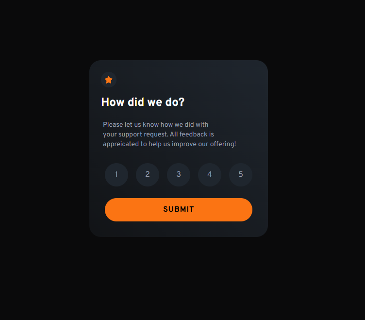
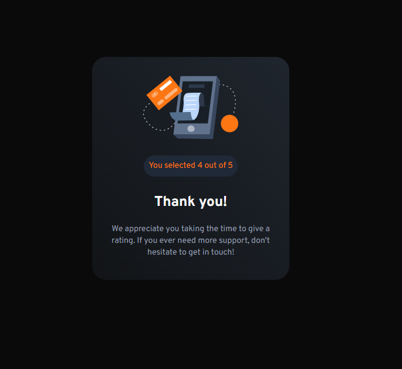

# Frontend Mentor - Interactive rating component solution

This is a solution to the [Interactive rating component challenge on Frontend Mentor](https://www.frontendmentor.io/challenges/interactive-rating-component-koxpeBUmI). Frontend Mentor challenges help you improve your coding skills by building realistic projects. 

## Table of contents

- [Overview](#overview)
  - [The challenge](#the-challenge)
  - [Screenshots](#screenshot)
  - [Links](#links)
- [My process](#my-process)
  - [Built with](#built-with)
  - [What I learned(and struggled with)](#what-i-learned)
  - [Continued development](#continued-development)
  - [Useful resources](#useful-resources)
- [Author](#author)
- [Acknowledgments](#acknowledgments)

## Overview

### The challenge

Users should be able to:

- View the optimal layout for the app depending on their device's screen size
- See hover states for all interactive elements on the page
- Select and submit a number rating
- See the "Thank you" card state after submitting a rating

### Screenshots

### Links

- Solution URL: [Solution on Frontend Mentor](https://www.frontendmentor.io/solutions/interactive-rating-compoent-17cPQdiKpP)
- Live Site: [GitHub Pages](https://tristanjtate.github.io/interactive-rating-component/m) 

## My process

### Built with

- Semantic HTML5 markup
- Tailwind CSS
- Flexbox
- Mobile-first workflow
- Vanilla JavaScript

### What I learned(and struggled with)

- How to setup and utilize Tailwind CSS
- How to work with Tailwind Config file to adding global attributes
- Structuring Code for clarity
- Dom Manipulation
- Managing visibility of components
- Troubleshooting in the Console
- Following a Design-Given Project

### Continued development

I will continue my knowledge in web development, and playing around with DOM Manipulation, and ideally grasp more knowledge in frameworks like React. I really enjoyed utilizing Tailwind CSS, and I will continue to implement this into future project.

### Useful resources

- [Tailwind CSS Documentation](https://tailwindcss.com/docs/utility-first) - Tailwind CSS documentation is extremely useful and the interface for documentation is AWESOME!

## Author

- Linkedin - [Tristan Tate](https://www.linkedin.com/in/tristantate/)
- Frontend Mentor - [@tristanjtate](https://www.frontendmentor.io/profile/tristanjtate)

## Acknowledgments

I want to thank **Frontend Mentor** for providing the challenge! This was a great way to dive into DOM Manipulation and I enjoyd the learning process. Of course, I always utilize ChatGPT as a tool, and I utilized this tool to reinforce learning along the way. Specifically, for understanding Tailwind and working with things like Event listeners and Class/ID selectors.

